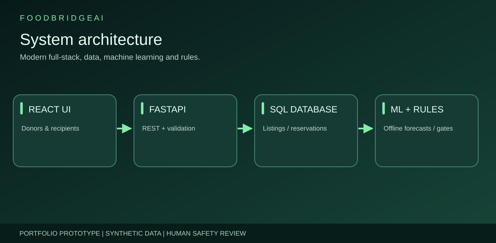
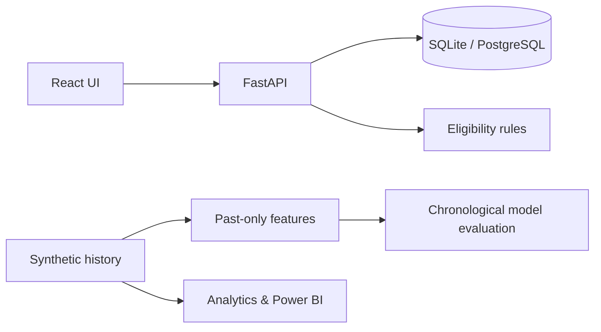
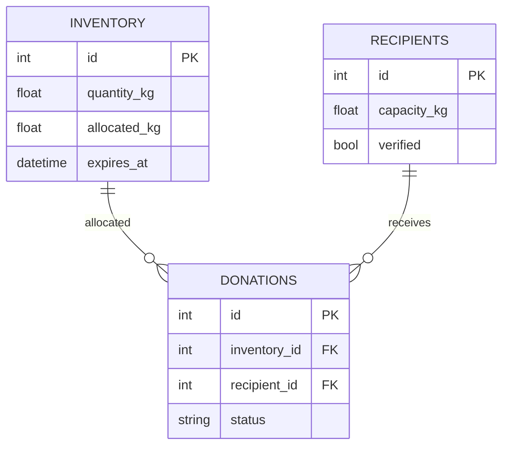

# System architecture

```mermaid
flowchart LR
  UI[React UI] --> API[FastAPI]
  API --> DB[(SQLite / PostgreSQL)]
  API --> Rules[Eligibility rules]
  CSV[Synthetic history] --> Features[Past-only features]
  Features --> ML[Chronological model evaluation]
  CSV --> BI[Analytics & Power BI]
```

```mermaid
erDiagram
 INVENTORY ||--o{ DONATIONS : allocated
 RECIPIENTS ||--o{ DONATIONS : receives
 INVENTORY { int id PK float quantity_kg float allocated_kg datetime expires_at }
 RECIPIENTS { int id PK float capacity_kg bool verified }
 DONATIONS { int id PK int inventory_id FK int recipient_id FK string status }
```

ML predictions are separate from operational listings. FAO publications are a research source, not live inventory.
